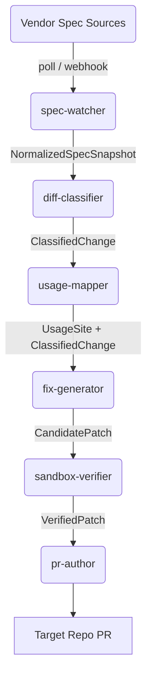

# Vigil

An open-source agentic system that detects vendor API/contract changes and opens verified, sandboxed PRs on affected codebases.

## Mission & Problem Statement

API providers ship breaking changes and useful new features constantly. Changelogs go unread, breaking changes ship with little warning, and useful features quietly launch and go unnoticed. This is a solved problem at the *package* level (Dependabot, Renovate) but an unsolved problem at the *API contract* level — nothing watches a vendor's OpenAPI/GraphQL/gRPC schema, maps it to your actual call sites, and opens a verified PR the way Dependabot does for a `package.json` bump.

**Vigil is that missing layer.** It is a neutral, vendor-agnostic, fully open-source system that:

1. Watches public API contracts (OpenAPI specs, GraphQL schemas, changelogs, SDK release notes, and — where available — live traffic) for vendors it tracks.
2. Classifies every detected change as `breaking`, `non_breaking`, `deprecation`, or `new_feature`.
3. Maps each change to actual usage sites in a subscribed codebase via static analysis.
4. Generates a fix (or an opt-in feature-adoption patch), verifies it in an isolated sandbox against the existing test suite, and opens a draft PR — never an auto-merge.
5. Never touches a repository without an explicit installation, and never merges anything itself.

**Non-negotiable design principle:** trust is earned incrementally. Read-only reporting ships before PR-opening. PR-opening ships long before anything resembling auto-merge.

## Architecture

Vigil uses a queue-backed, event-driven architecture to reliably parse, map, and patch vendor changes.



Every stage is a queue-backed, at-least-once, idempotent job. Subsystems communicate exclusively through standard schemas (via `packages/schemas`), allowing them to be independently scaled, tested, and deployed.

## Quickstart

### Prerequisites
- Node 20+
- pnpm 9+
- Docker & Docker Compose

### Local Development Setup
```bash
git clone https://github.com/THRISHAL12345/Vigil.git
cd Vigil
pnpm install
cp .env.example .env
docker compose -f infra/docker/docker-compose.dev.yml up -d
pnpm db:migrate
pnpm dev
```

## Contributing
See [CONTRIBUTING.md](./CONTRIBUTING.md) for detailed guidelines on how to contribute to Vigil. Before contributing, please read [AGENTS.md](./AGENTS.md) thoroughly as it is the single source of truth for the system architecture and trust model.

## License
This project is licensed under the [MIT License](./LICENSE).
