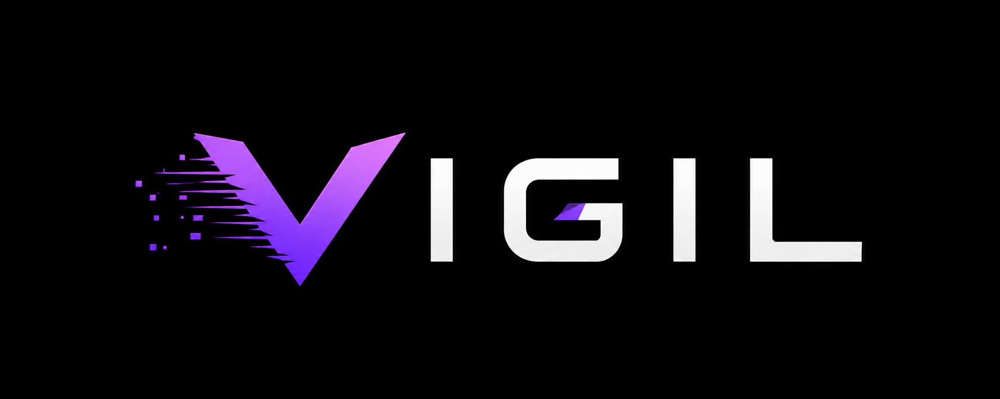
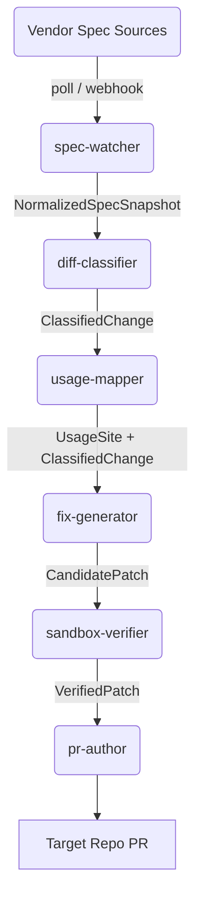

<div align="center">
  

  <br />
  <br />

  **The Open-Source Agentic System for Vendor API Contracts.**
  <br />
  *Never get blindsided by a breaking API change again.*

  <br />

  [](https://github.com/THRISHAL12345/Vigil/actions)
  [](./LICENSE)
  [](./CONTRIBUTING.md)
  [](https://nodejs.org/)
  [](https://www.typescriptlang.org/)

</div>

---

## ⚡ The Missing Layer for API Maintenance

API providers ship breaking changes and useful new features constantly. Changelogs go unread, breaking changes ship with little warning, and useful features quietly launch and go unnoticed. 

This is a solved problem at the *package* level (e.g., Dependabot, Renovate), but an **unsolved problem at the API contract level**. Nothing watches a vendor's OpenAPI schema, maps it to your actual call sites, and opens a verified PR.

**Vigil is that missing layer.** 

It is a neutral, vendor-agnostic, fully open-source system that:
1. 📡 **Watches public API contracts** (OpenAPI specs, GraphQL schemas, changelogs, SDK release notes).
2. 🏷️ **Classifies every detected change** as `breaking`, `non_breaking`, `deprecation`, or `new_feature`.
3. 🗺️ **Maps changes to your usage sites** in your codebase via blazing-fast WASM static analysis.
4. 🛠️ **Generates automated fixes**, verifies them in an isolated sandbox against your existing test suite, and opens a *Draft PR*.
5. 🛡️ **Respects your boundaries.** Vigil never touches a repository without an explicit installation, and it *never* merges code autonomously.

---

## 🏗️ Architecture

Vigil uses a queue-backed, event-driven architecture to reliably parse, map, and patch vendor changes. Every stage is an at-least-once, idempotent job, allowing independent scaling, testing, and deployment.



> [!IMPORTANT]
> **The Trust Ladder**: Trust is earned incrementally. Vigil's read-only reporting ships before PR-opening. Sandboxed execution isolates untested AI-generated patches. Auto-merge is explicitly out of scope. **Safety is our #1 priority.**

---

## 🚀 Quickstart

### Prerequisites
- [Node.js](https://nodejs.org/) 20+
- [pnpm](https://pnpm.io/) 9+
- [Docker](https://www.docker.com/) & Docker Compose

### Local Development Setup
Get Vigil running locally in minutes:

```bash
# 1. Clone the repository
git clone https://github.com/THRISHAL12345/Vigil.git
cd Vigil

# 2. Install dependencies
pnpm install

# 3. Setup environment variables
cp .env.example .env

# 4. Spin up local Redis & PostgreSQL instances
docker compose -f infra/docker/docker-compose.dev.yml up -d

# 5. Scaffold the database schema
pnpm db:migrate

# 6. Start the monorepo dev servers
pnpm dev
```

---

## 🤝 Contributing

We welcome community contributions! Vigil thrives on open-source collaboration.

1. **Read [AGENTS.md](./AGENTS.md) thoroughly.** This file is the single source of truth for the system architecture and trust model.
2. Check out [CONTRIBUTING.md](./CONTRIBUTING.md) for detailed guidelines.
3. Explore the `vendor-adapters/` directory if you'd like to help Vigil support new APIs!

---

<div align="center">
  <sub>Built with ❤️ by the open-source community.</sub>
</div>
